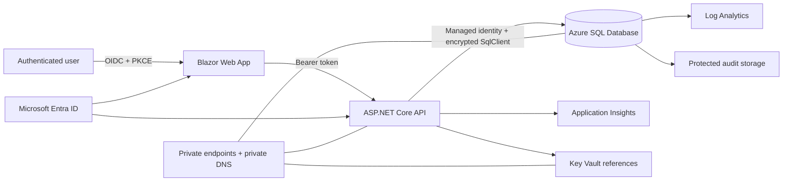

# Wealth Management Operations Platform

**Author:** Thomas Wagenberg  
**Purpose:** Original wealth-management operations application with SQL Server learning mode and Azure SQL deployment readiness  
**Data:** 100% fictional and synthetic  
**Verification status:** Three static toolchains executed: 71/71 original checks, 45/45 platform checks, and 26/26 execution-phase checks. SQL Server, .NET, Bicep, Entra, and Azure runtime verification remains blocked or unexecuted.

This repository began as a SQL Server learning project and was deliberately expanded into a layered .NET and Azure reference architecture without replacing the original T-SQL. The database remains the central portfolio asset. The API uses Dapper, views, and stored procedures rather than generated Entity Framework migrations.

> An original wealth-management operations platform built with Azure SQL deployment readiness and informed by Microsoft's publicly documented enterprise architecture and user-experience principles.

> This is a security-hardened educational reference implementation. It is not production proof, an audit opinion, regulatory approval, ISO certification, or SOC 2 certification.

## Two operating modes

### 1. Local learning mode

Study and execute the original numbered scripts in `sql/` with SQL Server and SQL Server Management Studio. The six original schemas, 15 base tables, synthetic data, views, functions, procedures, indexes, permissions, backup examples, import examples, and validation suite remain intact.

The original instructions are preserved in [docs/original-learning-readme.md](docs/original-learning-readme.md).

### 2. Azure application mode

Review or deploy a reference application composed of:

- .NET 10 ASP.NET Core Web API
- Dapper and `Microsoft.Data.SqlClient`
- Blazor Web App demonstration interface
- Microsoft Entra-compatible authentication
- Policy authorization mapped to database roles
- Azure SQL Database and managed identity
- Azure App Service, Key Vault, Monitor, Application Insights, Log Analytics, and protected Storage
- Modular Bicep profiles for development, staging, and production reference use
- GitHub Actions for CI, security review, packaging, and OIDC-based deployment

## Architecture



See:

- [Architecture overview](docs/architecture/overview.md)
- [Data flow](docs/architecture/data-flow.md)
- [Trust boundaries](docs/architecture/trust-boundaries.md)
- [Identity and authorization](docs/architecture/identity-authorization.md)
- [Database-access decision](docs/decisions/ADR-001-dapper-and-stored-procedures.md)
- [Azure SQL reference research](docs/AZURE_SQL_REFERENCE_RESEARCH.md)
- [Azure-inspired functional parity matrix](docs/AZURE_INSPIRED_FUNCTIONAL_PARITY_MATRIX.md)
- [Originality and brand review](docs/ORIGINALITY_AND_BRAND_REVIEW.md)

## Original database strengths preserved

- Six schemas: `core`, `market`, `trading`, `compliance`, `audit`, and `reporting`
- Fifteen original base tables
- Original synthetic advisors, clients, accounts, securities, prices, transactions, holdings, reviews, and alerts
- Reporting views and functions
- Stored procedures and transaction handling
- Explicit indexes and execution-plan exercises
- Database roles and permissions
- Backup, restore, and CSV import examples
- Original 15-test engine validation suite
- Original learning curriculum and GitHub documentation

The extended scripts live under `database/` so the original numbered learning sequence is not silently changed.

## Application capabilities

- Client and account portfolio reporting
- Asset allocation and unrealized gain or loss
- Risk alignment and concentration reporting
- Advisor activity reporting
- Paginated compliance-alert workflow with optimistic concurrency
- Synthetic trade entry with validation, oversell checks, idempotency, and audit evidence
- Authorized audit visibility
- Liveness, readiness, database-health, and version endpoints
- Correlation identifiers, structured logging, rate limiting, and RFC 7807 errors

## Security design

Implemented in source code or infrastructure templates:

- Production authentication cannot fall back to development headers
- Development users select only fixed synthetic identities; roles and advisor scope are resolved server-side
- Policy-based authorization for the five business roles
- Object-level checks plus SQL row-level security for advisor scope
- Curated reporting access instead of unrestricted raw-table access
- Managed identity pattern for Azure SQL
- Separate low-privilege local application login
- Parameterized SQL only
- Input allowlists, size limits, pagination limits, and request validation
- Idempotency protection for trade submission
- `rowversion` concurrency for workflow updates
- Temporal history for selected mutable records
- Reversal-oriented, append-only treatment for posted transactions
- Append-only hash-chained application audit events
- HTTPS, HSTS, CORS allowlist, secure headers, antiforgery, and safe errors
- Private endpoint, TLS, auditing, diagnostics, backup-retention, lock, budget, and vulnerability-assessment templates

See [security architecture](docs/security/security-architecture.md), [threat model](docs/security/threat-model.md), and [control mapping](docs/compliance/control-mapping.md).

## Repository structure

```text
src/        Layered .NET application and Blazor interface
tests/      Unit, integration, architecture, and security tests
sql/        Preserved original SQL Server learning sequence
data/       Preserved synthetic CSV files
database/   Application, security, Azure, and extended validation scripts
infra/      Modular Bicep and policy templates
.github/    CI, security, packaging, and deployment workflows
docs/       Architecture, security, operations, compliance, and ADRs
scripts/    Local setup, testing, and Azure deployment helpers
tools/      Original and expanded static validation tools
```

The complete generated tree is in [docs/repository-tree.txt](docs/repository-tree.txt).

## Local startup

### Prerequisites

- .NET 10 SDK matching `global.json`
- Docker with Linux containers, or a supported local SQL Server instance
- Python 3.11 or newer
- Optional SSMS for direct database study

### Database only

```bash
cp .env.example .env
# Replace both password placeholders in the uncommitted .env file.
./scripts/setup-local.sh
```

### Database, API, and web interface

```bash
cp .env.example .env
# Replace both password placeholders in the uncommitted .env file.
./scripts/setup-local.sh
docker compose --profile app up --build -d api web
```

Development URLs from `docker-compose.yml`:

- Web: `http://localhost:5188`
- API: `http://localhost:5187`

Development authentication is restricted to the `Development` environment. The local API connects through `wm_application`, not `sa`.

Detailed instructions: [docs/operations/local-development.md](docs/operations/local-development.md).

## Test commands

```bash
python3 tools/static_check.py
python3 tools/platform_static_check.py
python3 tools/generate_source_sbom.py
python3 tools/execution_phase_check.py
bash -n scripts/*.sh

dotnet restore WealthManagement.slnx
dotnet build WealthManagement.slnx -c Release --no-restore
dotnet test WealthManagement.slnx -c Release --no-build --collect:"XPlat Code Coverage"
```

Database integration tests require:

```bash
export WM_SQL_ADMIN_CONNECTION='Server=localhost,1433;Initial Catalog=WealthManagementOperations;User ID=sa;Password=...;Encrypt=True;TrustServerCertificate=True;'
export WM_SQL_INTEGRATION_CONNECTION='Server=localhost,1433;Initial Catalog=WealthManagementOperations;User ID=wm_application;Password=...;Encrypt=True;TrustServerCertificate=True;'
dotnet test tests/WealthManagement.IntegrationTests
```

The current evidence table is in [docs/operations/test-results.md](docs/operations/test-results.md), with gate-level detail in [docs/operations/execution-verification.md](docs/operations/execution-verification.md). Do not convert unexecuted tests into pass claims.

## Azure validation and deployment

No paid Azure resource was deployed while this repository was assembled.

```bash
export AZURE_SUBSCRIPTION_ID='...'
export AZURE_RESOURCE_GROUP='rg-wmops-dev'
export AZURE_LOCATION='eastus2'
export AZURE_SQL_ADMIN_LOGIN='...'
export AZURE_SQL_ADMIN_OBJECT_ID='...'
export WM_API_AUDIENCE='api://...'
export WM_ENTRA_AUTHORITY='https://login.microsoftonline.com/<tenant-id>/v2.0'
export WM_WEB_CLIENT_ID='...'
export WM_WEB_API_SCOPE='api://.../access_as_user'

az login
az account set --subscription "$AZURE_SUBSCRIPTION_ID"
az group create --name "$AZURE_RESOURCE_GROUP" --location "$AZURE_LOCATION"
az bicep build --file infra/bicep/main.bicep
az deployment group what-if \
  --resource-group "$AZURE_RESOURCE_GROUP" \
  --parameters infra/bicep/parameters/dev.bicepparam
az deployment group create \
  --resource-group "$AZURE_RESOURCE_GROUP" \
  --parameters infra/bicep/parameters/dev.bicepparam \
  --name wmops-dev-initial
```

Then deploy the schema as the Entra SQL administrator, create the managed-identity database principal from the template, publish the API and Web applications, and run the Azure validation procedure. Full instructions: [docs/operations/azure-deployment.md](docs/operations/azure-deployment.md).

## Cost posture

The development profile deliberately avoids private endpoints, zone redundancy, geo options, vulnerability assessment, and a budget resource by default. The production reference profile enables stronger networking and resilience assumptions but still leaves optional expensive services such as API Management, Front Door Premium/WAF, secondary-region deployment, and active geo-replication as documented decisions rather than automatic decoration.

See [cost estimation guide](docs/operations/cost-estimation.md). Verify current Azure pricing before any deployment.

## Verification boundary

### Executed in the packaging environment

- Original Python checker
- Expanded platform static checker
- Execution-phase source and wiring checker
- JSON, XML, YAML, shell, C#, SQL, and Bicep lexical or structural checks included by the platform checker
- Synthetic CSV row-count and relationship checks
- Secret-pattern and prohibited-artifact scans

### Not executed in the packaging environment

- .NET restore, compilation, unit tests, architecture tests, or security tests
- SQL Server or Azure SQL builds and engine validation
- Bicep compilation, Azure `what-if`, or deployment
- Entra login, app-role, or managed-identity testing
- Backup restore, failover, performance, accessibility, load, or penetration testing

See [known limitations](docs/known-limitations.md) and [production readiness](docs/operations/production-readiness.md).

## License

MIT. See [LICENSE](LICENSE).
