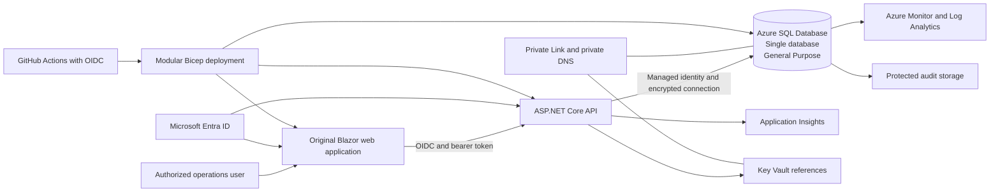

# Azure SQL Reference Research

**Project:** Wealth Management Operations Platform  
**Research date:** July 11, 2026  
**Source policy:** Official Microsoft and Azure sources were prioritized. No third-party source was required for the architecture recommendation in this document.  
**Evidence boundary:** This is source-backed design research. It does not prove that the Bicep templates compiled, that Azure resources were deployed, or that Azure SQL features operated successfully.

## 1. Executive summary

The appropriate cloud target for this repository is **Azure SQL Database as a single database**, reached from the ASP.NET Core application through **managed identity** and isolated with a **private endpoint** in non-development environments. The application should continue to use Dapper, curated views, and stored procedures because the hand-written T-SQL is a central learning and portfolio asset.

Azure SQL Managed Instance and SQL Server on Azure Virtual Machines are not justified for the current workload. The project does not depend on operating-system access, SQL Server Agent, cross-database instance behavior, or other instance-level features that would offset their greater cost and operating burden. Hyperscale, elastic pools, API Management, a second region, and Front Door Premium remain optional production decisions rather than decorative architecture.

For a production reference profile, the source-backed baseline is:

- Azure SQL Database, General Purpose, provisioned compute
- Zone redundancy where the selected region and service objective support it
- Microsoft Entra administrator and database-contained group or managed-identity principals
- Entra-only authentication for the production profile
- App Service managed identity for database access
- Public network access disabled, with Private Link and private DNS
- Transparent Data Encryption, with customer-managed keys as a reviewed option
- SQL auditing, Defender for SQL and vulnerability assessment when budget and operating ownership exist
- Automated backups, reviewed short-term and long-term retention, and a tested restore procedure
- Azure Monitor, Application Insights, Log Analytics, Query Store, and actionable alerts
- Modular Bicep and GitHub Actions using OpenID Connect rather than long-lived Azure credentials

The Azure account-selection page was studied for general information-design lessons, not as a visual template. Useful patterns include a clear hero, comparison framing, grouped categories, progressive disclosure, resource libraries, pricing explanations, FAQs, and obvious next steps. In this project, those ideas are transformed into original wealth-management workflows and documentation. Microsoft wording, code, layouts, logos, icons, imagery, screenshots, and brand assets are excluded.

The final recommended description is:

> An original wealth-management operations platform built with Azure SQL deployment readiness and informed by Microsoft's publicly documented enterprise architecture and user-experience principles.

## 2. Research method and evidence standard

The research separated four questions:

1. **Which Azure SQL service fits the workload?**
2. **Which security, reliability, performance, and deployment patterns are appropriate?**
3. **Which enterprise user-experience patterns can be transformed without copying Microsoft expression?**
4. **Which capabilities should be rejected because they add cost, complexity, or misleading scope?**

Current facts are linked to official sources below. Recommendations are identified as project-specific judgments. Pricing and limits must be reconfirmed immediately before deployment because they vary by region, service objective, currency, agreement, and date.

## 3. Official sources reviewed

| Official source | Topic used | Accessed |
|---|---|---|
| [Azure account and purchase-options experience](https://azure.microsoft.com/en-us/pricing/purchase-options/azure-account/search/) | Hero, account comparison, categorized services, resource library, FAQs, progressive disclosure, calls to action | July 11, 2026 |
| [Azure SQL: IaaS and PaaS options](https://learn.microsoft.com/en-us/azure/azure-sql/azure-sql-iaas-vs-paas-what-is-overview?view=azuresql) | Azure SQL Database, Managed Instance, and SQL Server on Azure VMs | July 11, 2026 |
| [Azure SQL Database and Managed Instance feature comparison](https://learn.microsoft.com/en-us/azure/azure-sql/database/features-comparison?view=azuresql) | Compatibility and feature boundaries | July 11, 2026 |
| [vCore service tiers](https://learn.microsoft.com/en-us/azure/azure-sql/database/service-tiers-sql-database-vcore?view=azuresql) | General Purpose, Business Critical, and Hyperscale | July 11, 2026 |
| [Serverless compute](https://learn.microsoft.com/en-us/azure/azure-sql/database/serverless-tier-overview?view=azuresql) | Auto-scaling, auto-pause conditions, and workload fit | July 11, 2026 |
| [Hyperscale](https://learn.microsoft.com/en-us/azure/azure-sql/database/service-tier-hyperscale?view=azuresql) | Compute and storage separation and large-scale use | July 11, 2026 |
| [Elastic pools](https://learn.microsoft.com/en-us/azure/azure-sql/database/elastic-pool-overview?view=azuresql) | Shared compute across multiple databases | July 11, 2026 |
| [Active geo-replication](https://learn.microsoft.com/en-us/azure/azure-sql/database/active-geo-replication-overview?view=azuresql) | Readable secondaries and regional recovery | July 11, 2026 |
| [Failover groups](https://learn.microsoft.com/en-us/azure/azure-sql/database/failover-group-sql-db?view=azuresql) | Managed multi-region failover and listener endpoints | July 11, 2026 |
| [Azure SQL security overview](https://learn.microsoft.com/en-us/azure/azure-sql/database/security-overview?view=azuresql) | Defense in depth, identity, RLS, encryption, auditing, classification | July 11, 2026 |
| [Microsoft Entra authentication for Azure SQL](https://learn.microsoft.com/en-us/azure/azure-sql/database/authentication-aad-overview?view=azuresql) | Groups, managed identities, Entra-only authentication, contained principals | July 11, 2026 |
| [Private endpoint for Azure SQL Database](https://learn.microsoft.com/en-us/azure/azure-sql/database/private-endpoint-overview?view=azuresql) | Private Link and network isolation | July 11, 2026 |
| [Transparent Data Encryption](https://learn.microsoft.com/en-us/azure/azure-sql/database/transparent-data-encryption-tde-overview?view=azuresql) | Encryption at rest and customer-managed-key options | July 11, 2026 |
| [Always Encrypted](https://learn.microsoft.com/en-us/sql/relational-databases/security/encryption/always-encrypted-database-engine?view=azuresqldb-current) | Client-side encryption and secure-enclave considerations | July 11, 2026 |
| [Azure SQL auditing](https://learn.microsoft.com/en-us/azure/azure-sql/database/auditing-overview?view=azuresql) | Audit destinations and governance evidence | July 11, 2026 |
| [Automated backups](https://learn.microsoft.com/en-us/azure/azure-sql/database/automated-backups-overview?view=azuresql) | Point-in-time restore and long-term retention | July 11, 2026 |
| [Availability and zone redundancy](https://learn.microsoft.com/en-us/azure/azure-sql/database/high-availability-sla-local-zone-redundancy?view=azuresql) | Local and zone-redundant availability | July 11, 2026 |
| [Monitoring and performance tuning](https://learn.microsoft.com/en-us/azure/azure-sql/database/monitoring-tuning-index?view=azuresql) | Azure Monitor, Query Store, advisors, resource limits, tuning | July 11, 2026 |
| [Automatic tuning](https://learn.microsoft.com/en-us/azure/azure-sql/database/automatic-tuning-overview?view=azuresql) | Plan correction and index recommendations | July 11, 2026 |
| [Intelligent applications and vector capabilities](https://learn.microsoft.com/en-us/azure/azure-sql/database/ai-artificial-intelligence-intelligent-applications?view=azuresql) | Current vector and AI-related capabilities; scope decision | July 11, 2026 |
| [Azure Well-Architected Framework](https://learn.microsoft.com/en-us/azure/well-architected/) | Reliability, security, cost, operations, and performance pillars | July 11, 2026 |
| [Microsoft Cloud Adoption Framework](https://learn.microsoft.com/en-us/azure/cloud-adoption-framework/) | Strategy, planning, readiness, governance, security, and management | July 11, 2026 |
| [Azure Architecture Center fundamentals](https://learn.microsoft.com/en-us/azure/architecture/guide/) | Architecture quality attributes, automation, and observability | July 11, 2026 |
| [App Service managed identity to Azure SQL](https://learn.microsoft.com/en-us/azure/app-service/tutorial-connect-msi-sql-database) | Passwordless database connection and minimum permissions | July 11, 2026 |
| [GitHub Actions authentication with OpenID Connect](https://learn.microsoft.com/en-us/azure/developer/github/connect-from-azure-openid-connect) | Federated credentials and removal of long-lived client secrets | July 11, 2026 |
| [App Service deployment slots](https://learn.microsoft.com/en-us/azure/app-service/deploy-staging-slots) | Staged deployment and rollback option | July 11, 2026 |
| [Bicep overview](https://learn.microsoft.com/en-us/azure/azure-resource-manager/bicep/overview) | Declarative, modular, repeatable infrastructure | July 11, 2026 |
| [Azure Monitor overview](https://learn.microsoft.com/en-us/azure/azure-monitor/fundamentals/overview) | Metrics, logs, traces, events, and alerts | July 11, 2026 |
| [Application Insights overview](https://learn.microsoft.com/en-us/azure/azure-monitor/app/app-insights-overview) | Application performance monitoring and OpenTelemetry | July 11, 2026 |
| [Azure Key Vault overview](https://learn.microsoft.com/en-us/azure/key-vault/general/overview) | Secret, key, and certificate management | July 11, 2026 |
| [Azure Private Link overview](https://learn.microsoft.com/en-us/azure/private-link/private-endpoint-overview) | Private endpoints and service isolation | July 11, 2026 |
| [Microsoft Cloud Security Benchmark](https://learn.microsoft.com/en-us/security/benchmark/azure/overview) | Cloud security control categories and implementation guidance | July 11, 2026 |
| [Azure SQL Database pricing](https://azure.microsoft.com/en-us/pricing/details/azure-sql-database/single/) | Purchasing models and time-sensitive pricing variables | July 11, 2026 |
| [Azure pricing calculator](https://azure.microsoft.com/en-us/pricing/calculator/) | Deployment-time cost estimation | July 11, 2026 |
| [Fluent 2 design system](https://fluent2.microsoft.design/) | General accessibility and component-quality research only | July 11, 2026 |
| [Microsoft Inclusive Design](https://inclusive.microsoft.design/) | Recognizing exclusion and designing for varied users | July 11, 2026 |
| [Microsoft trademark and brand guidelines](https://www.microsoft.com/en-us/legal/intellectualproperty/trademarks) | Factual references, non-affiliation, and prohibited brand use | July 11, 2026 |

## 4. Important Azure SQL capabilities

### 4.1 Product and service architecture

Microsoft presents Azure SQL as a family rather than one interchangeable service. Azure SQL Database is a database-as-a-service platform with the operating system, database engine maintenance, backups, and high-availability mechanisms managed by Azure. Managed Instance preserves more instance-level SQL Server compatibility. SQL Server on Azure Virtual Machines provides the greatest operating-system and engine control but also leaves substantially more administration with the customer. See the [official IaaS and PaaS comparison](https://learn.microsoft.com/en-us/azure/azure-sql/azure-sql-iaas-vs-paas-what-is-overview?view=azuresql).

**Project decision:** Use Azure SQL Database. The repository is a new application centered on one database, database-scoped schemas, views, functions, procedures, RLS, temporal history, and explicit application access. It does not require VM access or instance-level compatibility.

#### Single database versus elastic pool

A single database gives one application database an independent service objective. Elastic pools are designed for multiple databases with variable demand sharing a pool of resources. This repository has one primary database, so an elastic pool would add a concept without a present workload need. See [elastic pools](https://learn.microsoft.com/en-us/azure/azure-sql/database/elastic-pool-overview?view=azuresql).

#### Provisioned versus serverless compute

Provisioned compute is the clearer production baseline for a regularly available operations application. Serverless can be useful for intermittent development or demonstration workloads, but auto-pause depends on the absence of activity and sessions. Health probes, application connection pools, or scheduled processes can prevent the expected pause. See [serverless compute](https://learn.microsoft.com/en-us/azure/azure-sql/database/serverless-tier-overview?view=azuresql).

**Project decision:** Retain the existing predictable low-cost development profile. Document serverless as an optional experiment after measuring connection behavior. Do not imply guaranteed auto-pause savings.

#### Service tiers

- **General Purpose:** balanced compute and storage for common business workloads.
- **Business Critical:** designed for workloads requiring lower latency, higher resilience, and read-scale capabilities.
- **Hyperscale:** separates compute and storage architecture for very large or rapidly growing databases.

See the [vCore service-tier guide](https://learn.microsoft.com/en-us/azure/azure-sql/database/service-tiers-sql-database-vcore?view=azuresql) and [Hyperscale documentation](https://learn.microsoft.com/en-us/azure/azure-sql/database/service-tier-hyperscale?view=azuresql).

**Project decision:** General Purpose is the production-reference baseline. The synthetic portfolio does not justify Business Critical or Hyperscale. A real deployment must size from measured latency, concurrency, storage, and recovery requirements.

### 4.2 Data architecture

Azure SQL Database supports the relational capabilities used by this repository: schemas, tables, primary and foreign keys, check constraints, views, stored procedures, functions, indexes, transactions, row-level security, temporal tables, JSON functions, Query Store, and execution plans. Compatibility must still be proven by running the Azure-specific schema runner against the selected database compatibility level.

The original SQL learning sequence remains valuable because Azure SQL Database is not a reason to replace clear relational design with generated migrations. Dapper and stored-procedure or view-based access retain visible SQL ownership and reduce the risk that core financial logic becomes hidden inside an object-relational abstraction.

#### Transactions and concurrency

The project uses explicit transaction handling, `rowversion` checks for mutable compliance workflows, idempotency records for synthetic trade submission, and immutable or reversal-oriented treatment of posted transactions. These are application and database design controls. They still require SQL Server and Azure SQL execution tests.

#### Query plans and intelligent tuning

Azure SQL exposes Query Store, monitoring, advisors, automatic plan correction, and index recommendations. Automatic tuning can validate recommendations and reverse regressions, but it does not remove the need for workload-aware review. See [monitoring and tuning](https://learn.microsoft.com/en-us/azure/azure-sql/database/monitoring-tuning-index?view=azuresql) and [automatic tuning](https://learn.microsoft.com/en-us/azure/azure-sql/database/automatic-tuning-overview?view=azuresql).

**Project decision:** Do not claim the included indexes improved performance. Capture actual plans and Query Store evidence after deployment.

#### Change tracking, full-text search, JSON, and vectors

These features are useful only when a domain requirement exists. The current platform has no synchronization client that needs change tracking, no document-search use case that justifies full-text indexing, and no AI or retrieval workflow that justifies vector storage. Microsoft documents current AI and vector capabilities, but adding them for appearance would weaken the design. See [Azure SQL intelligent applications](https://learn.microsoft.com/en-us/azure/azure-sql/database/ai-artificial-intelligence-intelligent-applications?view=azuresql).

### 4.3 Security and governance

The Azure SQL security model is defense in depth. It combines identity, database authorization, network isolation, encryption, threat detection, auditing, classification, and operational review. See the [Azure SQL security overview](https://learn.microsoft.com/en-us/azure/azure-sql/database/security-overview?view=azuresql).

#### Identity and least privilege

Microsoft Entra authentication supports centralized identities, groups, managed identities, conditional-access integration, and Entra-only authentication. Azure role-based access control does not automatically grant data-plane access inside the database; database principals and permissions are still required. See [Microsoft Entra authentication for Azure SQL](https://learn.microsoft.com/en-us/azure/azure-sql/database/authentication-aad-overview?view=azuresql).

**Project decision:**

- Use an Entra group as the Azure SQL administrator rather than an individual account.
- Use the App Service managed identity as the application database principal.
- Grant that principal only curated views and stored procedures through application roles.
- Use Entra-only authentication in the production profile.
- Keep SQL authentication limited to the local learning environment.

#### Network isolation

Private endpoints bring the Azure SQL logical server into a virtual network through Private Link. Private DNS must resolve the service name correctly. Public network access should be disabled for production. See the [Azure SQL private-endpoint guide](https://learn.microsoft.com/en-us/azure/azure-sql/database/private-endpoint-overview?view=azuresql) and [Private Link overview](https://learn.microsoft.com/en-us/azure/private-link/private-endpoint-overview).

#### Encryption and key management

Transparent Data Encryption protects database files and backups at rest. Customer-managed keys add control and operating obligations, including availability and rotation of the key. Always Encrypted can keep selected values encrypted from the database engine, but it affects query patterns, drivers, keys, and operational support. See [TDE](https://learn.microsoft.com/en-us/azure/azure-sql/database/transparent-data-encryption-tde-overview?view=azuresql), [Always Encrypted](https://learn.microsoft.com/en-us/sql/relational-databases/security/encryption/always-encrypted-database-engine?view=azuresqldb-current), and [Key Vault](https://learn.microsoft.com/en-us/azure/key-vault/general/overview).

**Project decision:** Keep TDE as the baseline. Keep customer-managed TDE keys and Always Encrypted as reviewed options. Do not enable Always Encrypted on account numbers or client identifiers until query compatibility, key custody, incident recovery, and deployment operations are tested.

#### RLS, masking, classification, audit, and threat protection

- Row-level security is a defense-in-depth control for advisor scope.
- Dynamic data masking reduces accidental exposure but is not an authorization boundary.
- Sensitivity classification documents handling expectations.
- Auditing should send evidence to protected storage and monitoring systems.
- Defender for SQL and vulnerability assessment require budget, alert ownership, and remediation procedures.

The repository contains code or templates for these areas, but none is a certification or proof of operational effectiveness.

### 4.4 Reliability and recovery

Azure SQL Database provides automated backups and point-in-time restore. Long-term retention can preserve selected backups for extended periods. The [backup documentation](https://learn.microsoft.com/en-us/azure/azure-sql/database/automated-backups-overview?view=azuresql) must be checked at deployment time for current retention and redundancy behavior.

Zone redundancy is a regional availability option, not a complete disaster-recovery strategy. A second region requires active geo-replication or a failover group, a tested failover process, application connection behavior, data-loss tolerance, and explicit RTO and RPO decisions. See [availability and zone redundancy](https://learn.microsoft.com/en-us/azure/azure-sql/database/high-availability-sla-local-zone-redundancy?view=azuresql), [active geo-replication](https://learn.microsoft.com/en-us/azure/azure-sql/database/active-geo-replication-overview?view=azuresql), and [failover groups](https://learn.microsoft.com/en-us/azure/azure-sql/database/failover-group-sql-db?view=azuresql).

**Project decision:**

- Keep zone redundancy enabled in the production reference profile where supported.
- Configure and review backup retention.
- Require restore drills before making recovery claims.
- Treat a failover group and second region as optional until business impact analysis establishes RTO, RPO, and cost justification.
- Do not publish numerical RTO or RPO targets without an owner, architecture, and test evidence.

### 4.5 Performance and operations

A responsible operating model uses application telemetry and database telemetry together:

- Application Insights for request, dependency, failure, and performance signals
- Azure Monitor and Log Analytics for metrics, logs, alerts, and cross-resource investigation
- Azure SQL Query Store, DMVs, resource metrics, and advisor output
- Connection pooling, command timeouts, cancellation tokens, and transient-fault handling in the application
- No blind retries of non-idempotent financial operations

See [Azure Monitor](https://learn.microsoft.com/en-us/azure/azure-monitor/fundamentals/overview), [Application Insights](https://learn.microsoft.com/en-us/azure/azure-monitor/app/app-insights-overview), and [Azure SQL monitoring](https://learn.microsoft.com/en-us/azure/azure-sql/database/monitoring-tuning-index?view=azuresql).

### 4.6 Development and deployment

The project uses Bicep because it is a Microsoft-native declarative language with modules, type validation, repeatable deployments, and what-if support. See the [Bicep overview](https://learn.microsoft.com/en-us/azure/azure-resource-manager/bicep/overview).

App Service managed identity removes a database password from production configuration. GitHub Actions OpenID Connect removes the need for a long-lived Azure deployment secret. See [managed identity to Azure SQL](https://learn.microsoft.com/en-us/azure/app-service/tutorial-connect-msi-sql-database) and [GitHub OIDC](https://learn.microsoft.com/en-us/azure/developer/github/connect-from-azure-openid-connect).

Deployment slots can support staged application releases, but database schema changes still require a separately designed expand-and-contract process. See [App Service deployment slots](https://learn.microsoft.com/en-us/azure/app-service/deploy-staging-slots).

**Project decision:** Keep slots as an optional production enhancement. Do not present slot swaps as automatic database rollback.

## 5. Relevant Azure architectural patterns

The [Azure Well-Architected Framework](https://learn.microsoft.com/en-us/azure/well-architected/) provides the review structure:

| Pillar | Project application |
|---|---|
| Reliability | Health endpoints, retries limited to transient operations, backup and restore runbooks, zone-redundancy option, DR decision record |
| Security | Entra identity, managed identity, least privilege, RLS, private networking, TDE, audit evidence, secure SDLC workflows |
| Cost optimization | Low-cost development profile, optional paid controls, budget template, no decorative second region or API Management |
| Operational excellence | Bicep, GitHub Actions, structured logging, runbooks, change evidence, production-readiness checklist |
| Performance efficiency | Dapper, curated SQL, indexes, Query Store plan, paging limits, monitoring and scaling guidance |

The [Cloud Adoption Framework](https://learn.microsoft.com/en-us/azure/cloud-adoption-framework/) adds organizational work that a repository cannot supply: strategy, ownership, landing-zone policy, governance, security operations, cost management, and ongoing service management.

## 6. Relevant Azure user-experience patterns

The [Azure account-selection page](https://azure.microsoft.com/en-us/pricing/purchase-options/azure-account/search/) demonstrates how a complex product can be explained without exposing every detail at once. The useful general patterns are:

- A full-width opening statement with one clear outcome
- Comparison tables that make tradeoffs explicit
- Categories that reduce a large product set into recognizable groups
- Search and filtering where the catalog is large enough to justify it
- Section navigation for long-form decision content
- Progressive disclosure instead of one overwhelming screen
- Resource libraries and calculators near decision points
- Plain-language cost explanations and limitations
- Frequently asked questions that address risk and uncertainty
- Strong next-step pathways
- Responsive, keyboard-operable components and meaningful hierarchy

### Transformation for this project

The application does not reproduce the Azure sales journey. It transforms general ideas into wealth-management operations:

- Service categories become client, portfolio, risk, compliance, trade, audit, and health modules.
- Account-plan comparison becomes local-learning versus Azure-application operating modes.
- Azure activity logs become the platform audit-evidence view.
- Azure status concepts become liveness, readiness, database connectivity, and application version endpoints.
- Azure SQL performance guidance becomes operational monitoring documentation, not a fake dashboard.
- Pricing explanation becomes a deployment cost guide with calculator instructions, not fabricated dollar values.

The complete mapping is in [AZURE_INSPIRED_FUNCTIONAL_PARITY_MATRIX.md](AZURE_INSPIRED_FUNCTIONAL_PARITY_MATRIX.md).

## 7. Patterns appropriate for this project

| Pattern | Why it fits | Repository evidence |
|---|---|---|
| Azure SQL Database single database | One application database with database-scoped SQL features | `infra/bicep/modules/data.bicep`, `database/azure/run_azure_schema.sql` |
| General Purpose production baseline | Balanced reference tier without unsupported scale claims | `infra/bicep/modules/data.bicep`, production parameters |
| Managed identity | Removes a production SQL password | `src/WealthManagement.Infrastructure/Data/SqlConnectionFactory.cs`, `infra/bicep/modules/app.bicep` |
| Entra-only production identity | Centralized identities and reduced SQL-auth exposure | `database/azure/30_entra_principals_template.sql`, Bicep data module |
| Private endpoint and private DNS | Production network isolation | `infra/bicep/modules/network.bicep`, `infra/bicep/modules/data.bicep` |
| Dapper plus stored procedures | Preserves explicit SQL knowledge and curated access | `src/WealthManagement.Infrastructure/Repositories/`, `database/local/22_application_procedures.sql` |
| RLS plus object authorization | Defense in depth for advisor access | `database/security/21_identity_and_row_level_security.sql`, API policies |
| Temporal history and rowversion | Traceable workflow changes and safe concurrency | `database/security/24_temporal_history.sql`, compliance workflow |
| TDE, auditing, classifications | Appropriate baseline data-protection and evidence controls | Azure SQL defaults and `database/azure/` templates |
| Azure Monitor and App Insights | Application and database operational visibility | `infra/bicep/modules/monitoring.bicep`, API telemetry configuration |
| Bicep and OIDC workflows | Repeatable infrastructure and short-lived deployment identity | `infra/bicep/`, `.github/workflows/azure-deploy.yml` |
| Restore and incident runbooks | Reliability requires practiced procedures, not only service settings | `docs/operations/disaster-recovery.md`, `docs/operations/incident-response.md` |

## 8. Patterns inappropriate for the current project

| Pattern | Why it is not the baseline |
|---|---|
| Azure SQL Managed Instance | No demonstrated instance-level dependency that justifies the cost and operational footprint |
| SQL Server on Azure Virtual Machines | No need for operating-system access or customer-managed engine maintenance |
| Hyperscale | Dataset and expected workload do not approach the scale that justifies the architecture |
| Elastic pool | Only one primary application database is modeled |
| Business Critical by default | No measured latency, availability, or read-scale requirement supports it |
| Active geo-replication by default | No approved RTO, RPO, second-region ownership, or recovery test exists |
| API Management by default | One portfolio API does not yet justify an additional gateway product and operating layer |
| Front Door Premium and WAF by default | No public production traffic model or global edge requirement has been established |
| Vector search or AI features | No valid wealth-management workflow requires them in the current application |
| Global product search | The authenticated application has a small, role-focused navigation model; compliance filtering is sufficient |
| Azure portal visual imitation | It would create IP, brand, and user-confusion risk without improving the domain workflow |
| Exact Azure pricing in repository text | Pricing changes by region, agreement, date, and configuration |

## 9. Cost considerations

The [Azure SQL pricing page](https://azure.microsoft.com/en-us/pricing/details/azure-sql-database/single/) states that costs depend on purchasing model, tier, compute, storage, backup, region, and commercial agreement. Use the [Azure pricing calculator](https://azure.microsoft.com/en-us/pricing/calculator/) immediately before any deployment decision.

Cost controls for this project:

- Development avoids private endpoints and paid security options by default.
- Budget deployment remains disabled until an amount and notification owner are supplied.
- Production options such as Defender, private endpoints, longer retention, zone redundancy, higher telemetry, WAF, API Management, and a second region must be priced separately.
- Reserved capacity or Azure Hybrid Benefit must not be assumed without entitlement and workload stability.
- Serverless should be evaluated with real connection and activity behavior rather than assumed to auto-pause.
- Log volume and retention must be capped and reviewed because observability can become a material cost.

No exact current prices are recorded in this repository.

## 10. Security considerations

The design should be reviewed against the [Microsoft Cloud Security Benchmark](https://learn.microsoft.com/en-us/security/benchmark/azure/overview), but the benchmark does not make the repository compliant by itself.

Priority controls:

1. Entra group administrator and managed identities
2. Entra-only authentication in production
3. Database-contained principals and least-privilege grants
4. Public network disabled, private endpoints, private DNS, and controlled egress
5. TLS validation without bypassing certificate trust
6. RLS and application object checks
7. TDE, reviewed CMK option, and carefully scoped Always Encrypted evaluation
8. Protected SQL auditing and application audit evidence
9. Defender and vulnerability assessment with an assigned response process
10. Secret rotation, access reviews, emergency access, and incident procedures

## 11. Reliability considerations

- Confirm selected-region support for zone redundancy.
- Define recovery requirements before selecting geo-replication or failover groups.
- Perform database restore drills and application recovery exercises.
- Use retry logic only for recognized transient failures.
- Make financial submissions idempotent before any retry.
- Monitor connection pool exhaustion, DTU or vCore saturation, storage, deadlocks, failed logins, error rates, and restore health.
- Treat application deployment and database deployment as coordinated but independently reversible changes.

## 12. Accessibility considerations

Microsoft's [Inclusive Design](https://inclusive.microsoft.design/) frames accessibility as recognizing exclusion and using diverse user needs to improve the product. The [Fluent 2 site](https://fluent2.microsoft.design/) was studied only for general component and accessibility quality, not copied assets or source code.

Project requirements:

- Keyboard access to navigation, forms, filters, pagination, and actions
- Visible focus indicators
- Semantic headings, landmarks, labels, and tables
- Strong text and status contrast
- Status communicated through words, not color alone
- Loading, empty, validation, error, and authorization states
- Responsive tables or alternative small-screen presentation
- Captions and transcripts for demonstration videos
- Automated accessibility checks plus manual keyboard and screen-reader testing before public claims

The current source contains semantic HTML and keyboard-native controls, but accessibility testing was not executed.

## 13. Legal and brand-separation requirements

The [Microsoft trademark guidelines](https://www.microsoft.com/en-us/legal/intellectualproperty/trademarks) permit truthful factual references while prohibiting misleading affiliation and inappropriate use of Microsoft brand assets.

This project must:

- Lead with its own product name and visual identity.
- Mention Microsoft, Azure, Azure SQL, Entra, and App Service only as factual technologies or research sources.
- Avoid Microsoft and Azure names in the application name, company name, logo, domain, or primary branding.
- Avoid Microsoft logos, Azure icons, screenshots, illustrations, photography, video, source code, marketing copy, exact layouts, and proprietary templates.
- Avoid statements of Microsoft sponsorship, approval, certification, or affiliation.
- Attribute copied facts in documentation and paraphrase them in original language.
- Complete the independent-design review in [ORIGINALITY_AND_BRAND_REVIEW.md](ORIGINALITY_AND_BRAND_REVIEW.md).

This design review is not legal advice and cannot guarantee non-infringement.

## 14. Source-backed architecture recommendation

### Recommended final architecture

### Decision statement

Use **Azure SQL Database, single database, General Purpose, provisioned compute** for the production reference. Use App Service managed identities, Entra-contained database principals, private networking, TDE, protected auditing, Azure Monitor, Application Insights, and modular Bicep. Keep zone redundancy in the production template where supported. Keep customer-managed keys, Defender, vulnerability assessment, deployment slots, active geo-replication, failover groups, Front Door, WAF, and API Management as separately justified options.

### Alignment with the finished repository

The repository already represents this architecture in source and templates. The research does not convert those representations into deployment proof. The following remain required before a production-readiness claim:

- .NET restore, compilation, tests, and accessibility review
- SQL Server and Azure SQL engine execution
- Bicep build and `what-if`
- Entra and managed-identity authentication tests
- Private DNS and network validation
- Permission, RLS, audit, backup, restore, monitoring, and alert tests
- Load and query-plan evidence
- Threat-model review and independent security assessment
- Cost estimate using the current calculator
- Operational ownership and incident-response exercises

## 15. Research conclusion

The project should borrow Microsoft's **discipline**, not Microsoft's **expression**. The defensible outcome is an independently designed wealth-management operations application that uses Azure SQL deployment patterns where they solve a real problem, rejects costly or fashionable features where they do not, and distinguishes source code and infrastructure templates from executed operational evidence.
