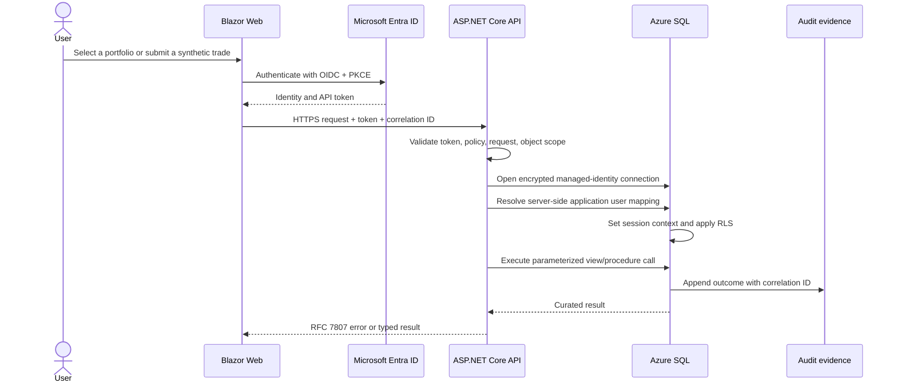

# Data-flow diagram

No browser-supplied role, advisor identifier, or client identifier is treated as authorization proof. Production roles originate from Entra and are resolved against `security.AppUser` before database session context is set.
