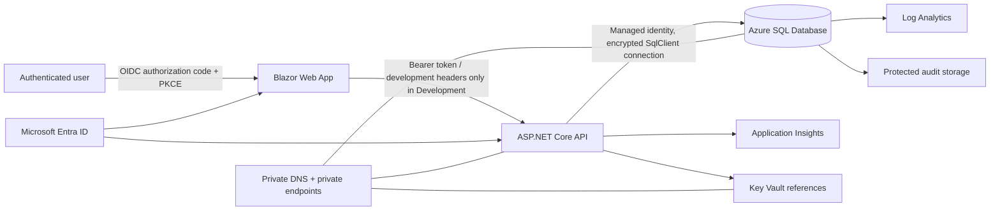

# Architecture overview

The application is a reference architecture, not a deployed production system. The local profile uses SQL Server and development-only authentication. The Azure profile uses Entra authentication, managed identity, curated procedures and views, private networking, Key Vault, and centralized monitoring.

## Layers

- **Contracts:** transport-safe records
- **Application:** use cases, validation, access checks
- **Infrastructure:** Dapper, `Microsoft.Data.SqlClient`, health checks
- **API:** authentication, policies, middleware, endpoints
- **Web:** Blazor demonstration interface
- **Database:** original SQL plus optional application and Azure hardening scripts
- **Infrastructure:** modular Bicep with development, staging, and production profiles
