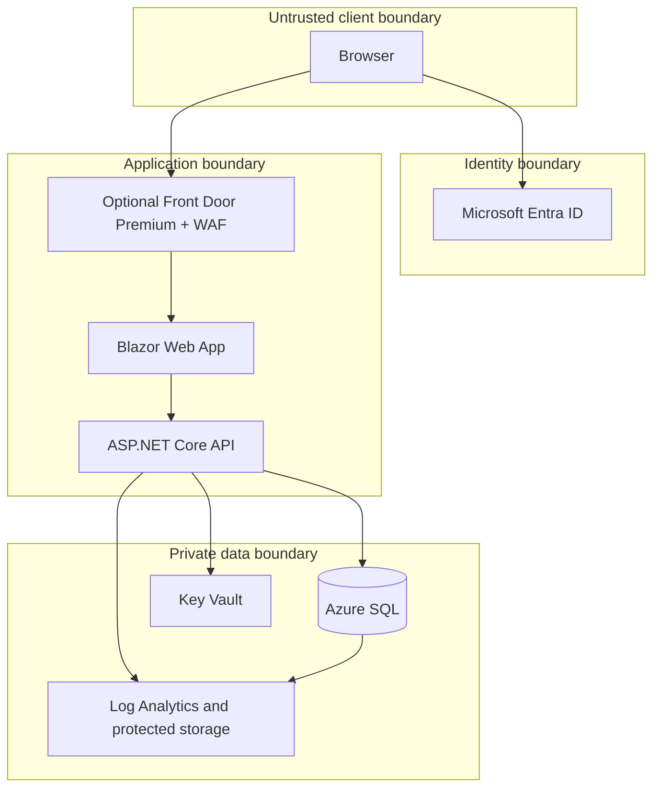

# Trust boundaries

Key boundaries are token validation, application policy enforcement, object-level access checks, managed-identity database access, database role grants, RLS, and append-oriented audit evidence. Private endpoints reduce exposure but do not replace identity or authorization.
