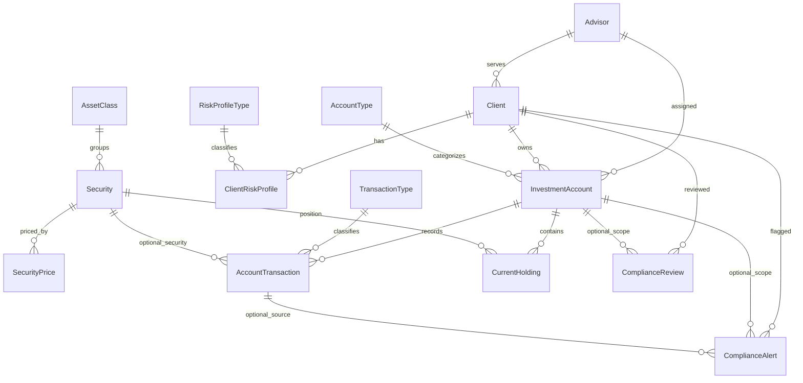

# Database design

## Design goals

The database balances professional structure with student readability. It separates business domains, uses surrogate primary keys, preserves stable business identifiers with unique constraints, and makes invalid states harder to store.

## Schema strategy

| Schema | Reason |
|---|---|
| `core` | Stable client, advisor, profile, and account entities |
| `market` | Security master and price history |
| `trading` | Transactions and current positions |
| `compliance` | Review and alert workflows |
| `audit` | Append-oriented activity evidence |
| `reporting` | Curated read models and procedures |

Separating schemas improves navigation and gives permissions a meaningful boundary.

## Relationship map

## Important decisions

### Surrogate keys plus business keys

Integer or bigint identity columns serve as primary keys. Human-readable codes such as `ClientCode`, `AccountNumber`, and `Symbol` are separately unique. This avoids making mutable business text the physical relationship key.

### Money and quantity types

- Dollar totals use `decimal(19,2)`.
- Security quantities and unit prices use `decimal(19,6)`.
- Percentages use fixed decimal types.
- Floating-point types are avoided for financial calculations because binary approximation can create unexpected rounding behavior.

### Timestamps

Business dates use `date`. Audit and record timestamps use `datetime2(0)` with `SYSUTCDATETIME()`. UTC reduces ambiguity between locations, but a real application would still document how user-facing time zones are handled.

### Current risk profile

Historical profile rows are allowed, but a filtered unique index permits only one row per client where `IsCurrent = 1`.

### Transaction validation

A security transaction must either have all three security fields (`SecurityID`, `Quantity`, and `Price`) or none. When present, quantity and price must be positive. Gross amount and fee cannot be negative, and settlement cannot precede trade date.

The stored procedure adds stronger business checks for BUY and SELL activity, including open-account validation and prevention of overselling.

### Holdings method

`CurrentHolding` is a materialized educational summary:

- Quantity equals cumulative BUY quantity minus cumulative SELL quantity.
- Average cost uses weighted purchase cost.
- Selling reduces quantity but does not change average cost.
- The project does not model tax lots, cash, realized gains, wash sales, or corporate actions.

A production design might calculate positions from an immutable ledger, maintain tax lots, and rebuild summaries through controlled jobs.

### Pricing

Seven synthetic price dates are stored per security. Portfolio reports select the latest price on or before the holding’s `AsOfDate`. This avoids accidentally using a future price.

### Compliance state rules

Completed reviews require a completion date. Open or in-review alerts cannot have a resolved date; resolved or dismissed alerts must have one. These rules are enforced with checks, not only application convention.

### Reporting layer

Views centralize portfolio value, allocation, risk alignment, compliance status, and advisor activity. This reduces repeated logic and supports security through curated access.

## Normalization

The design is primarily in third normal form:

- Repeating classifications are in reference tables.
- Client, advisor, account, security, and transaction facts are stored once.
- Price history is separated by security and date.
- Risk profile history is separated from the client.
- Reporting calculations are not duplicated across base tables.

`CurrentHolding` is an intentional denormalized summary for performance and teaching. Its reconciliation rule is tested.

## Delete behavior

Foreign keys do not use cascading deletes. In a financial or compliance context, automatic cascade deletion can erase related history too easily. Deletion should be explicit, reviewed, and often replaced by inactive/status flags or retention workflows.

## Naming rules

- Singular table names
- PascalCase objects and columns
- Schema-qualified references
- `PK_`, `FK_`, `UQ_`, `CK_`, `DF_`, `IX_`, and `UX_` prefixes
- `ID` suffix for keys
- `Date`, `At`, `Amount`, `Pct`, and `Code` suffixes communicate meaning

## Limitations that matter in interviews

A strong explanation should acknowledge that a production wealth platform would need:

- Household and entity relationships
- Cash and full ledger accounting
- Tax lots and realized gains
- Corporate actions
- Market-data quality controls
- Row-level and attribute-based access
- Encryption and key rotation
- Data retention and legal holds
- Regulatory supervision and tested disaster recovery
